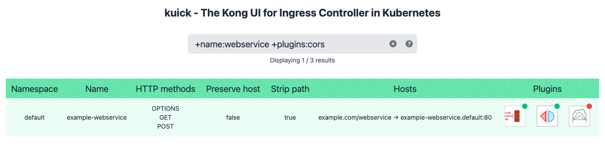

# kuick - The Kong UI for Ingress Controller in Kubernetes



## Status

This project is still in very early development, and currently only supports a few k8s API objects (tested on v1.17.17). As such, it may outright not work on your Kuberentes cluster. Pull requests and testing are welcome!

## Installation

kuick is deployed directly to the Kubernetes cluster that it must have API access to. You can change the configuration variables in the following steps (names, namespaces, etc.) to what makes the most sense for your use case. Default configuration files are available in the [`k8s/`](k8s/) directory.

1. Create a ServiceAccount for `kuick`:

```yml
# kuick-service-account.yaml
apiVersion: v1
kind: ServiceAccount
metadata:
  name: kuick
  namespace: default
```

2. Set up a `kuick-role` role with the proper Role-Based Access Control (RBAC) authorization for the ServiceAccount. At a minimum, it should be able to list `ingresses` and `kongplugins` in the k8s API:

```yml
# kuick-cluster-role.yaml
apiVersion: rbac.authorization.k8s.io/v1
kind: ClusterRole
metadata:
  name: kuick-role
  namespace: default
rules:
  - apiGroups: ["networking.k8s.io"]
    resources: ["ingresses"]
    verbs: ["list"]
  - apiGroups: ["configuration.konghq.com"]
    resources: ["kongplugins"]
    verbs: ["list"]
---
# kuick-cluster-role-binding.yaml
apiVersion: rbac.authorization.k8s.io/v1
kind: ClusterRoleBinding
metadata:
  name: kuick-role
  namespace: default
subjects:
  - kind: ServiceAccount
    apiGroup: ""
    name: kuick
    namespace: default
roleRef:
  kind: ClusterRole
  apiGroup: rbac.authorization.k8s.io
  name: kuick-role
```

3. Deploy kuick with the previously configured `serviceAccountName` in the PodSpec. You can set the HTTP port with the `PORT` envvar (default is `8080`):

```yml
# kuick-deployment.yaml
apiVersion: apps/v1
kind: Deployment
metadata:
  name: kuick
  namespace: default
  annotations:
    repo_url: https://github.com/simetnicbr/kuick
  labels:
    app: kuick
spec:
  selector:
    matchLabels:
      app: kuick
  replicas: 1
  template:
    metadata:
      labels:
        app: kuick
    spec:
      serviceAccountName: kuick
      containers:
        - name: kuick
          image: ghcr.io/simetnicbr/kuick:latest  # NOTE: Public images are not available yet! Use your private registry.
          imagePullPolicy: Always
          env:
            - name: PORT
              value: '8080'
          resources:
            limits:
              memory: 512Mi
              cpu: "1"
            requests:
              memory: 512Mi
              cpu: "1"
          ports:
            - containerPort: 8080
              protocol: TCP
```

1. (optional) Set up a Service, Ingress, and KongPlugins (such as `ip-restriction`) to remotely access the web interface:

```yml
# kuick-service.yaml
apiVersion: v1
kind: Service
metadata:
  name: kuick
  namespace: default
spec:
  type: ClusterIP
  ports:
    - name: client
      port: 8080
      protocol: TCP
  selector:
    app: kuick
---
# kuick-ingress.yaml
apiVersion: networking.k8s.io/v1beta1
kind: Ingress
metadata:
  annotations:
    kubernetes.io/ingress.class: kong
    konghq.com/methods: "OPTIONS,GET"
    konghq.com/preserve-host: "false"
    konghq.com/strip-path: "true"
    konghq.com/plugins: kuick-ip-restriction-plugin
  name: kuick
  namespace: default
spec:
  rules:
  - host: dev.example.com
    http:
      paths:
        - backend:
            serviceName: kuick
            servicePort: 8080
          path: /kuick
  tls:
    - hosts:
        - dev.example.com
      secretName: example.com
---
# kuick-ip-restriction-plugin.yaml
apiVersion: configuration.konghq.com/v1
kind: KongPlugin
metadata:
  name: kuick-ip-restriction-plugin
  namespace: default
plugin: ip-restriction
enabled: true
config:
  allow: 
    - 10.0.0.0/8
    - fde1:efdc:34f2:18fe::/64
```

## Development

You can build and test kuick locally using Docker:

```sh
docker build -t kuick-dev .
docker run --rm -e TEST_MODE=true -p 8080:8080 --name kuick kuick-dev
```

## License

This project is licensed under a modified version of GNU General Public License version 3. Please read the [`LICENSE.txt`](LICENSE.txt) file.
